# Lab 01: Account Lockout Investigation and Resolution

**Environment:** Windows Server 2022 Domain Controller | Windows 11 Client Workstation | Active Directory | lab.local  
**Tools Used:** Active Directory Users and Computers, Event Viewer, Command Prompt  
**Scenario Type:** Access Management / Authentication Failure

---

## The Ticket

**Subject:** Can’t log into my computer

**From:** John Doe

**Priority:** Normal

“Hey, I tried logging in and it’s not working. It just keeps saying ‘try again.’ Did I do something wrong?

---

Yes, John. You did do something wrong. But no need to kick you while you’re down. 

Let’s just get this sorted out. 

---

## Environment

- **Domain Controller:** Windows Server 2022 — LAB-DC01, hosting Active Directory and DNS for lab.local
- **Client Workstation:** Windows 11 — WINCLIENT01, domain joined to lab.local
- **Account Lockout Policy:** 3 invalid attempts, 30 minute lockout duration, 15 minute observation window — configured via Group Policy and verified with `net accounts` prior to scenario execution

---

## Breaking It

Logged into WINCLIENT01 as John Doe — `LAB\jdoe` — and entered the wrong password three times at the Windows 11 login screen.

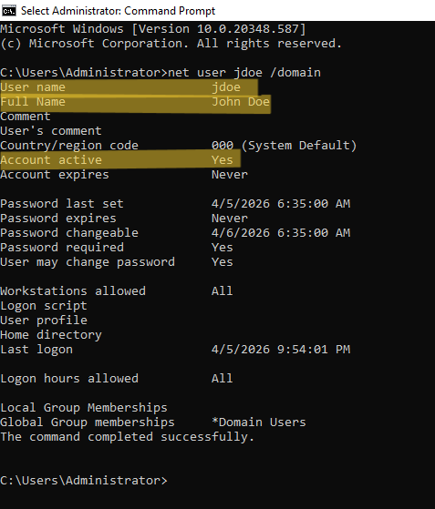

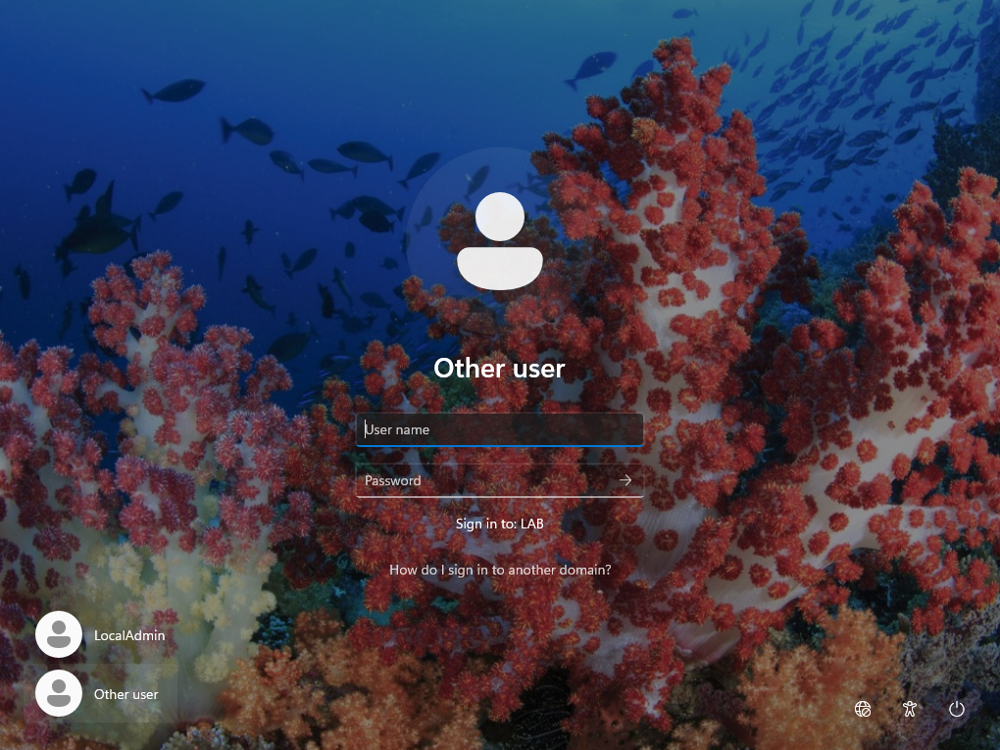

Even after the third attempt, Windows just said, "The user name or password is incorrect. Try again." The account was locked behind the scenes without advertising that fact to poor John Doe.

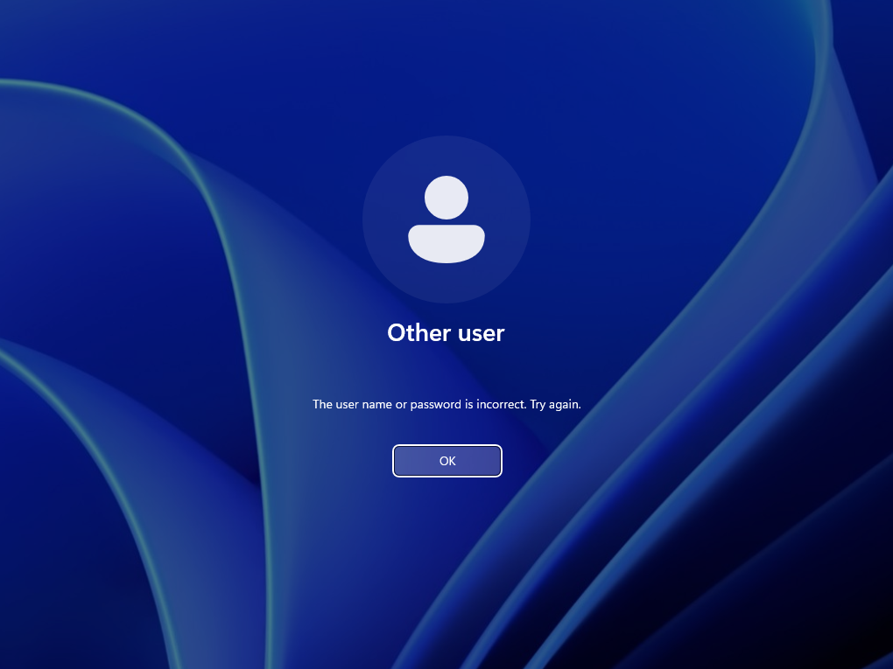

That seems intentional. You don't want the login screen confirming to an attacker that they've successfully exhausted the lockout threshold. 

---

## The Investigation

**Confirming the lockout:**

Verified the account state directly via CLI:

`net user jdoe /domain`

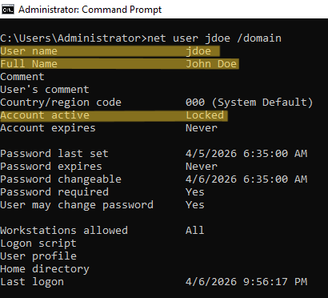

Account active: Locked. Ground truth established.

**First stop: DC Event Viewer**

Pulled up the Security log on the DC and filtered for Event ID `4625` — failed logon attempts. 

Nothing there from WINCLIENT01.

My understanding is that Event Viewer only shows logs from the machine you're on. It doesn't aggregate across the domain automatically. When you open Event Viewer on the DC you're looking at the DC's story, not the whole network's story. To pull logs from a remote machine you'd need to explicitly connect to it via Action → Connect to Another Computer — or better, have a SIEM like Wazuh collecting logs from every machine on the network into a single queryable interface.

Failed interactive logons at the Windows login screen are processed and logged locally on the workstation where they occur. The DC only enters the picture when it makes the lockout decision.

**Second stop: WINCLIENT01 Event Viewer**

Logged into WINCLIENT01 as `WINCLIENT01\LocalAdmin` — John Doe being locked out meant his credentials weren't available — and pulled the Security log there.

Three 4625 events. All pointing at jdoe.

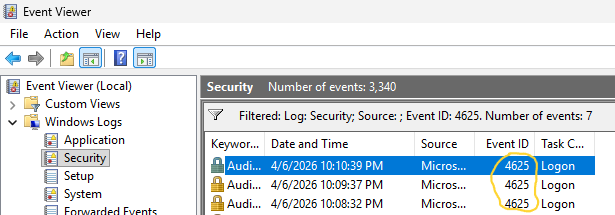

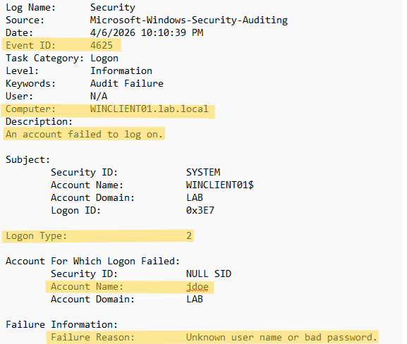

Key fields:

- **Account Name:** jdoe
- **Failure Reason:** Unknown username or bad password — deliberately ambiguous
- **Logon Type:** 2 — interactive logon, someone at a keyboard

**Third stop: Back to the DC**

Filtered the DC Security log for Event ID `4740` — the lockout event. One entry. The DC made the call to lock the account after the third failed attempt, logged it, and moved on.

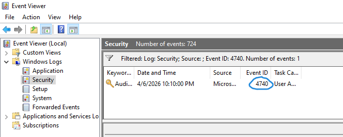

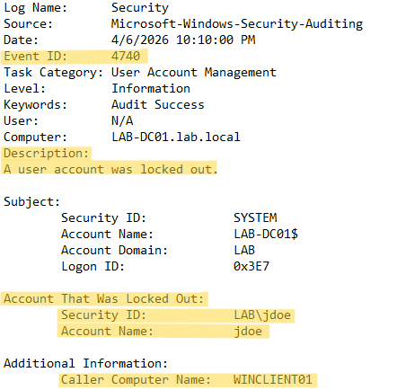

- **Account Name:** jdoe
- **Caller Computer Name:** WINCLIENT01

That ‘Caller Computer Name’ field might be the one that matters most in a real investigation. WINCLIENT01 is exactly where we expect the attempts to come from. A machine name nobody recognizes in that field is a different conversation entirely.

---

## Resolution

Opened Active Directory Users and Computers on the DC. Navigated to LabUsers, right clicked John Doe, Properties, Account tab. Checked Unlock account, clicked Apply.

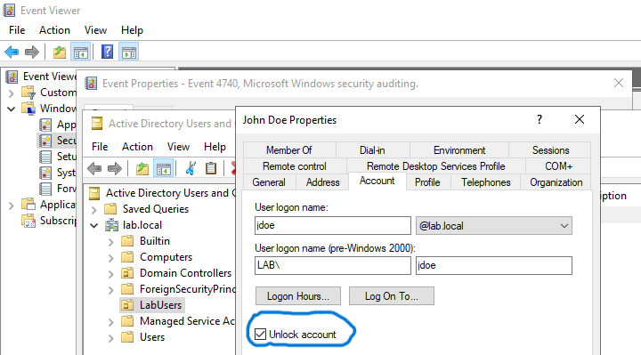

Verified via CLI:

`net user jdoe /domain`

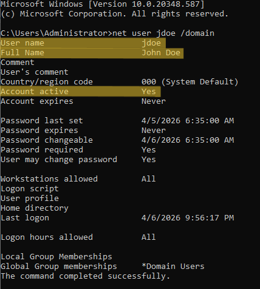

Account active. No locked out flag. John Doe back in business.

Returned to WINCLIENT01, logged in as `LAB\jdoe` with correct credentials. Successful. Desktop loaded.

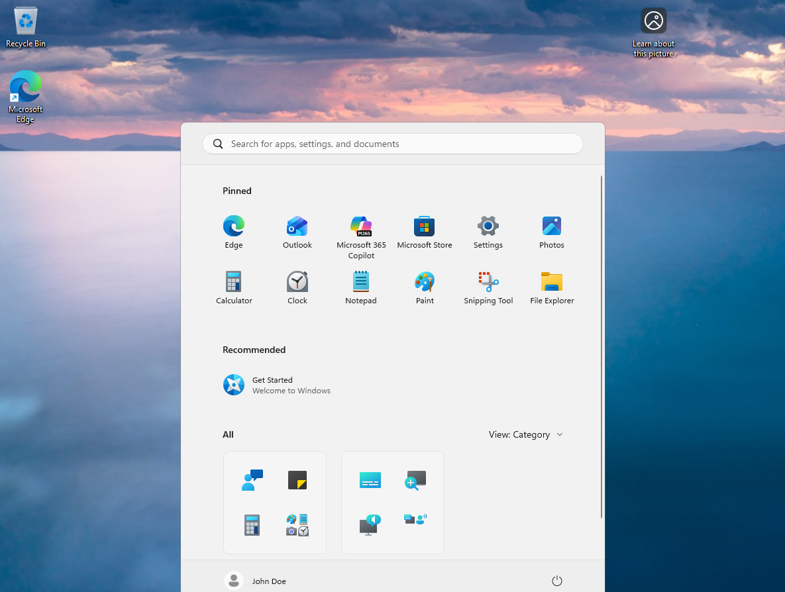

All is well in the world.

---

## The Complications

**The silent lockout.**  
Expected the Windows 11 login screen to announce the lockout explicitly after the third failed attempt. It didn't. Just kept saying "try again." In a real environment a user experiencing this would have no idea whether they had more attempts available or whether the account was already gone. They call helpdesk. Helpdesk checks. That's the workflow — the OS isn't going to tell them.

**The logs weren't where I looked first.**  
Initial instinct was to check the DC Security log for failed logon events. They weren't there — they were on the client machine. Failed interactive logons log locally on the workstation where they occur, not on the Domain Controller. The DC logged the lockout decision but not the individual failed attempts. 

---

## Security Implications

In a real enterprise environment with a SIEM running — Wazuh, Splunk, 
whatever — the lockout event generates an alert in the security dashboard 
the moment it happens. The SIEM is constantly parsing logs — three 4625 
events followed by a 4740 triggers a detection rule, fires an alert, and 
the security team knows about it before the user has finished deciding 
whether to call helpdesk or just restart their computer and hope for the best.

The sequence in that world:
1. Account locks — DC logs the 4740
2. SIEM alerts — security team sees it
3. User notices and calls helpdesk

The data point arrives before the ticket does.

Before unlocking anything in a production environment, three questions worth asking:

**Does the pattern match a forgotten password?** One account, one source machine, business hours — probably a user. Multiple accounts, multiple machines, 3am — probably not.

**What does Caller Computer Name tell you?** The user's own workstation is expected. A server they've never touched means the security team is now involved.

**Who unlocked it and did they ask any questions?** An account unlock is an identity verification moment. A social engineer's first call might be, "Hi I'm locked out, can you reset my password?" Confirming you're actually talking to the person who owns the account shuts down a potential attack vector.

---

## Tools Reference

- Active Directory Users and Computers — account unlock and status verification
- Event Viewer Security Log — 4625 (failed logon), 4740 (account lockout)
- `net user /domain` — account status verification
- `net accounts` — lockout policy verification
- Group Policy Management — lockout policy configuration
